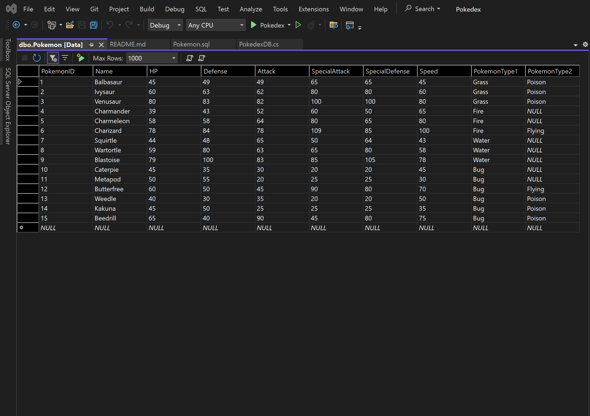

# Pokedex -   CPW 211 Teams Project 

## Game Description: 
You play as a new Pokémon Trainer, you are given a Pokedex to:
discover and collect new Pokémon, view Pokemon Stats, Pokémon Types,
and retrieve data from previously collected Pokemon. 

## Database Info:
Example of the database schema and values used in the project: 

# Tech Stack:
- Language: C#
- Framework .Net 9.0 (Windows Forms)
- Database: SQL Server ('PokedexDB')

# How to run the program: 
1. Download zip file in the repository or clone the repository. 
2. Open the solution file "(`.sln`)" in Visual Studio.
3. Ensure you have the required .NET 9.0 installed.
4. **Database Setup** (Choose one of the following options):

   ## Option A: Using LocalDB (Recommended for Development)
   LocalDB is included with Visual Studio and doesn't require a separate SQL Server installation.
   
   1. **Enable LocalDB** (if not already enabled):
      - Open Visual Studio Installer
      - Modify your Visual Studio installation
      - Under "Individual components", ensure "SQL Server Express 2019 LocalDB" is checked
      - Install if needed and restart Visual Studio
   
   2. **Create and Setup the Database with Pokemon Data**:
      
      ### Method 1: Using Visual Studio (Recommended)
      - Open SQL Server Object Explorer in Visual Studio (View → SQL Server Object Explorer)
      - Expand "(localdb)\MSSQLLocalDB"
      - Right-click on "(localdb)\MSSQLLocalDB" → New Query
      - Copy and paste the **entire contents** of `team-docs/PokedexDatabase.sql` into the query window
      - **Execute the script** (Ctrl+Shift+E or click Execute button)
      - This will create the PokedexDB database, all tables, and populate with 15 Pokemon
      
      ### Method 2: Using SQL Server Management Studio (SSMS)
      - Download and install SSMS if not already installed
      - Connect to server: `(localdb)\MSSQLLocalDB`
      - Open the `team-docs/PokedexDatabase.sql` file in SSMS
      - **Execute the script** (F5 or click Execute button)
   
   3. **Verify the Setup**:
      - In SQL Server Object Explorer, expand "(localdb)\MSSQLLocalDB" → Databases
      - You should see "PokedexDB" database
      - Expand PokedexDB → Tables to see: Pokemon, Users, SaveFile, CollectedPokemon
      - Right-click on "Pokemon" table → View Data to verify 15 Pokemon are loaded:
        - Bulbasaur, Ivysaur, Venusaur (Grass/Poison)
        - Charmander, Charmeleon, Charizard (Fire/Flying)
        - Squirtle, Wartortle, Blastoise (Water)
        - Caterpie, Metapod, Butterfree, Weedle, Kakuna, Beedrill (Bug types)

   ## Option B: Using Full SQL Server with SSMS
   1. Ensure SQL Server 2022 (or later) is installed and running
   2. Open SQL Server Management Studio and connect to your server
   3. Run the SQL script in the `team-docs/PokedexDatabase.sql` file to create the database and tables
   4. **Update the connection string** in `Pokedex/PokedexDB.cs` to match your SQL Server instance if different from LocalDB

5. **Run the Application**:
   - Run the project by clicking the "Start" button in Visual Studio
   - **Expected Result**: You should see a message "Database connection, complete!"
   - If you see an error instead, refer to the troubleshooting section below

## Troubleshooting Database Connection Issues:

### Common LocalDB Issues:
- **"Cannot connect to (localdb)\MSSQLLocalDB"**: 
  - Ensure LocalDB is installed and running (see Option A above)
  - Try running `sqllocaldb info MSSQLLocalDB` in Command Prompt to check status
  - If not running, try `sqllocaldb start MSSQLLocalDB`

- **"Database 'PokedexDB' does not exist"**: 
  - The database script wasn't executed properly
  - Re-run the complete `team-docs/PokedexDatabase.sql` script
  - Ensure you execute the **entire script**, not just portions

- **"SELECT * FROM Pokemon" fails or returns empty**:
  - The Pokemon table wasn't populated with data
  - Verify the INSERT statements in the SQL script were executed
  - You should have 15 Pokemon records (Bulbasaur through Beedrill)

### Verification Steps:
1. **Check if LocalDB is running**: Open Command Prompt and run `sqllocaldb info`
2. **Verify database exists**: In SQL Server Object Explorer, look for PokedexDB under (localdb)\MSSQLLocalDB
3. **Check Pokemon data**: Query `SELECT COUNT(*) FROM Pokemon` should return 15
4. **Test connection**: The application will show "Database connection, complete!" if successful

### Common Setup Mistakes:
- **Partial script execution**: Make sure to run the **complete** PokedexDatabase.sql file
- **Wrong database name**: The database must be named exactly "PokedexDB" (case sensitive)
- **Missing LocalDB**: Install SQL Server Express LocalDB through Visual Studio Installer

# Meet Team #3   (Alphabetical Order):
- Adelisse Ferris
- Alex Fischer 
- Kourtnie Moore

## Special Thanks to:  
- Joeseph Ortiz

*more information to be added later~~*
